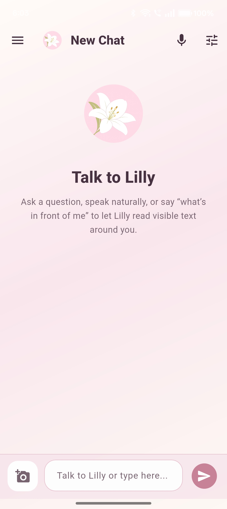
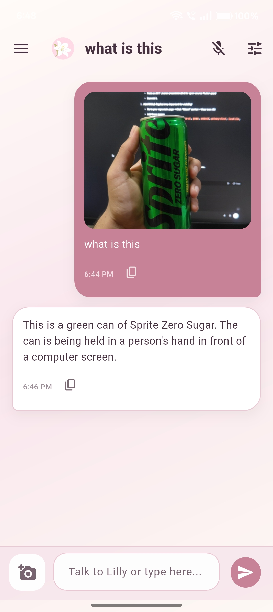
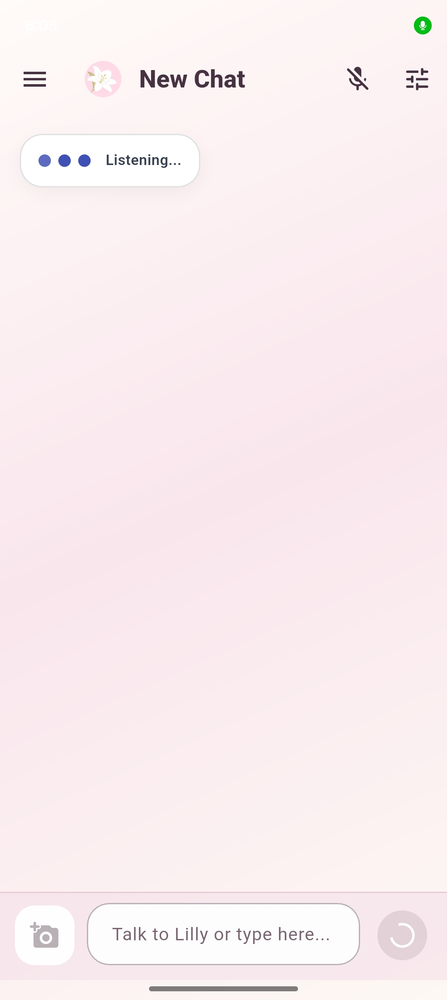
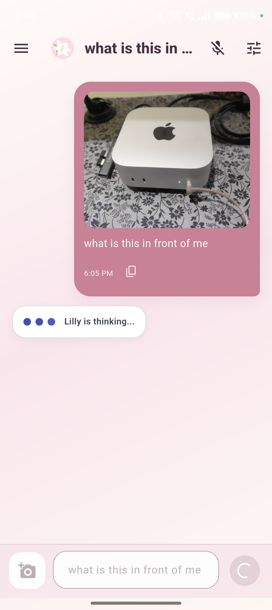
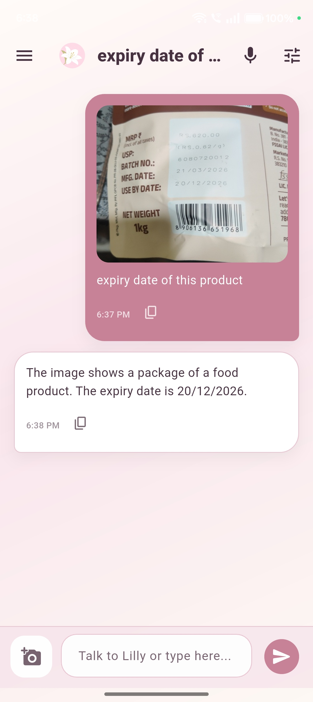
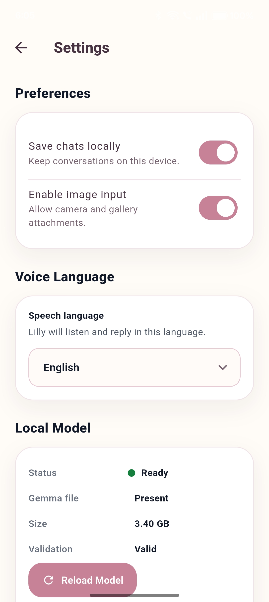

# Lilly

[](https://github.com/MaNaS0708/Lilly/releases)
[](https://huggingface.co/litert-community/gemma-4-E2B-it-litert-lm)
[](https://github.com/google-ai-edge/LiteRT-LM)
[](https://developer.android.com)
[](https://flutter.dev)
[](LICENSE)

**Lilly is a private, on-device voice assistant designed to empower visually impaired and blind users with greater independence, confidence, and privacy in everyday life.**

Built on Android with **Flutter**, **native Kotlin**, **Gemma 4 (E2B)**, **LiteRT-LM**, and **Sherpa ONNX**, Lilly can listen, respond, describe what the camera sees, read visible text, and stay available through wake-word activation. Its core promise is simple: **the moments that matter most should not have to leave your phone to become accessible.**

---

## About Lilly

For many visually impaired people, access to the world is often delayed by friction that others barely notice: a label on a bottle, a sign at a station, a message on a screen, an unfamiliar object on a table, or a doorway in a new room.

Lilly was created to reduce that friction with dignity.

It is not built around the idea of “fixing” anyone. It is built around the belief that better tools can expand autonomy. A good assistive experience should feel respectful, dependable, and private. It should work in the real world, including moments where connectivity is weak, time is short, and the information in front of you is personal.

That is why Lilly is built to be:

- voice-first, for eyes-free interaction
- on-device, for privacy and resilience
- multimodal, so it can reason about both words and images
- offline-capable after setup, so accessibility is not held hostage by the network

---

## Key Features

### Voice-first conversation
Lilly supports natural spoken interaction using on-device speech recognition and spoken replies. The goal is not to make the user navigate an interface more efficiently, but to let the interface step out of the way.

### Wake-word activation
Lilly includes wake-word support for hands-free access. This matters deeply in assistive contexts: a person should not always have to unlock, aim, tap, and navigate before they can ask a question.

### Camera-based scene understanding
Users can ask Lilly questions such as:

- “What is this?”
- “What’s in front of me?”
- “Describe this scene.”

Lilly can use camera input to understand nearby objects and surroundings through a local multimodal inference path.

### OCR fallback for reading visible text
When a scene includes text, Lilly can fall back to OCR and read content such as:

- labels
- signs
- packaging
- menus
- handwritten or printed notes
- text on screens

### Local, private AI
Lilly’s core assistant reasoning runs on-device through Gemma 4 via LiteRT-LM. Conversations and visual context do not need to be sent to external servers for inference.

### Model management inside the app
Lilly includes local setup, validation, reload, and delete controls so the model lifecycle is visible and manageable rather than hidden from the user.

---

## Screenshots

| Home | Voice Chat |
|---|---|
|  |  |

| Voice Mode Active | Processing |
|---|---|
|  |  |

| Response | Settings |
|---|---|
|  |  |

---

## How It Works

Lilly combines a Flutter interface with Android-native runtime components.

### Core stack

- **Flutter** for the app experience
- **Kotlin** for Android-native inference and trigger integration
- **Gemma 4 E2B** as the local multimodal model
- **LiteRT-LM** for on-device model execution
- **Sherpa ONNX** for wake-word detection
- **speech_to_text** for voice recognition
- **flutter_tts** for spoken replies
- **ML Kit OCR** for text extraction fallback
- **camera** for in-app image capture

### First-run setup workflow

On first launch, Lilly:

1. asks the user to choose a primary voice language
2. checks whether the model is already present and valid
3. authenticates with Hugging Face if model access requires it
4. prompts the user to accept the model license if needed
5. downloads the Gemma 4 LiteRT-LM model into app-private storage
6. validates the downloaded file
7. initializes the local LiteRT-LM runtime

After setup, the assistant’s core reasoning happens locally on the phone.

### Voice conversation workflow

1. the user speaks to Lilly
2. speech is converted to text
3. Lilly prepares a local prompt
4. Gemma 4 generates a response on-device
5. Lilly speaks the response back
6. if voice conversation mode is active, Lilly can resume listening for the next turn

### Camera and image workflow

1. the user attaches or captures an image
2. Lilly first attempts native multimodal reasoning through Gemma 4
3. if direct image understanding is limited, Lilly uses OCR fallback for visible text
4. the extracted image or text context is passed into the assistant response flow

This is especially useful for reading labels, signs, packaging, or nearby text that would otherwise remain inaccessible without another person’s help.

### Wake-word workflow

Wake-word support is powered by an Android foreground service using Sherpa ONNX.

The intended experience is:

1. the user enables wake-word support in Settings
2. Lilly starts a foreground trigger service
3. the wake-word model is prepared locally if needed
4. Lilly listens for the wake phrase

When the wake phrase is detected:

- **If Lilly is already open**, the app can route directly into voice chat.
- **If Lilly is not in the foreground**, Android may block direct background UI launches. In that case, Lilly raises a high-priority notification so the user can enter voice chat safely and reliably.

This is an important platform truth, and it is worth stating clearly: **modern Android does not allow third-party apps to freely open themselves from the background whenever they want.** Lilly does not pretend otherwise. Instead, it uses the most accessible and Android-compliant path available.

That means the wake-word experience is intentionally designed to be:

- hands-free when the app is already active
- notification-assisted when Android background rules require it
- transparent rather than misleading

### Trigger recovery workflow

If trigger autostart is enabled, Lilly can restart the foreground trigger service after device reboot or package replacement through its Android receiver flow. This helps keep the wake-word experience more persistent across normal device lifecycle events.

---

## Why On-Device and Private Matters

For assistive technology, privacy is not a luxury feature. It is a trust feature.

A person may want help reading:

- a bank statement
- a medical label
- a private message
- a personal document
- something inside their home
- something in public that reveals where they are

Those moments are deeply personal. Lilly is built so those moments do not need to become uploaded events.

On-device inference also matters for digital equity:

- not everyone has stable high-speed internet
- not every important question happens in a place with reliable connectivity
- accessibility should continue to work even when the network does not
- private assistance should not depend on a constant cloud connection

Lilly’s design philosophy is simple: **access should remain available even when the signal is weak, the environment is sensitive, or the moment is private.**

---

## Performance and Device Requirements

Lilly is powerful, but it is also demanding. That is an honest part of the project.

The app can feel heavy on some devices for a few clear reasons:

### The model is large
Lilly uses **Gemma 4 E2B**, and the local model file is roughly **2.6 GB**. Loading a model of that size is very different from loading a normal app asset or a lightweight mobile feature.

### Inference happens on the phone
Lilly is not sending prompts to a remote server. The device itself has to:

- load the model into memory
- initialize the LiteRT-LM runtime
- prepare text or image context
- run the actual reasoning locally

That privacy benefit comes with a real performance cost, especially on mid-range or older phones.

### Multimodal tasks are heavier than text-only chat
When Lilly is asked to describe a scene, inspect an object, or combine OCR with conversation, the workload becomes more expensive than plain text interaction.

### Android system rules add lifecycle overhead
Wake-word listening, microphone access, notifications, foreground services, and app lifecycle handling all need to operate within Android’s restrictions. That makes the app more complex than a standard single-screen assistant.

### Device differences matter a lot
Performance depends heavily on:

- available RAM
- storage speed
- thermal limits
- chipset and backend compatibility
- how aggressively the device manages background apps

Two Android phones can run the same build very differently.

### What this means in practice

- first-run setup can take time
- initial model loading can feel slow
- image-based tasks are heavier than text-only tasks
- weaker devices may relaunch or struggle under memory pressure

This is the tradeoff Lilly makes in order to stay private, local, and independent of cloud inference.

---

## Impact and Vision

The most meaningful assistive technologies are often not the loudest ones.

They do not ask users to adapt themselves to the system.  
They adapt the system to the user’s life.

Lilly is a step toward that kind of technology.

It imagines an assistant that can stand beside a visually impaired user in everyday moments:

- noticing what is in front of them
- reading what others can see instantly
- answering naturally by voice
- remaining available without exposing intimate moments to the cloud

That is not only a technical goal. It is a dignity question.

Greater independence often comes from reducing friction in very small moments. If Lilly can help someone identify an object, read a label privately, or ask a question without hunting through a screen, then it is doing something meaningful: it is making access feel more immediate, more personal, and more self-directed.

The larger vision is a future where multimodal AI is used not merely to impress, but to expand agency for people who have too often been excluded from default digital and physical experiences.

---

## Getting Started

### Requirements

- Flutter SDK compatible with Dart `^3.11.4`
- Android Studio
- Android SDK
- A physical Android device is strongly recommended
- Enough device storage for the model download
- A Hugging Face account with access to the Gemma 4 LiteRT-LM model

### Install dependencies

```bash
flutter pub get
```

### Generate launcher icons

```bash
dart run flutter_launcher_icons
```

### Run locally

```bash
flutter run
```

### Build a release APK

```bash
flutter clean
flutter build apk --release
```

### Optional APK rename

Flutter typically outputs:

```text
build/app/outputs/flutter-apk/app-release.apk
```

If you want a cleaner filename:

```bash
cp build/app/outputs/flutter-apk/app-release.apk build/app/outputs/flutter-apk/lilly.apk
```

### Model details

- **Model:** `gemma-4-E2B-it.litertlm`
- **Approximate size:** roughly `2.6 GB`
- **Minimum accepted size:** `2,500,000,000` bytes
- **Source:** [Gemma 4 E2B LiteRT-LM on Hugging Face](https://huggingface.co/litert-community/gemma-4-E2B-it-litert-lm)

### Important setup notes

- first-run setup requires a large model download
- a stable connection is recommended during initial setup
- after setup, core inference is local
- deleting the model from Settings requires a fresh download later

---

## Current Limitations and Future Roadmap

Lilly is meaningful today, but it is still early work. Being honest about that matters.

### Current limitations

- Lilly is currently **Android-first**
- iOS local inference is not wired yet in this repository
- first-run model setup is heavy because the model is large
- performance depends strongly on device RAM and backend compatibility
- wake-word behavior is constrained by Android background rules
- OCR coverage is intentionally limited today, with current focus on **Latin** and **Devanagari**
- some weaker devices may struggle with model initialization or long sessions

### Roadmap

- faster warm-start model behavior
- stronger voice-loop reliability
- better multimodal prompting and scene understanding
- broader OCR support where it clearly improves real-world accessibility
- more diagnostic visibility for trigger and model lifecycle issues
- more refined accessibility feedback patterns
- investigation of an eventual iOS path once the native runtime story matures

---

## Repository

- **GitHub:** [MaNaS0708/Lilly](https://github.com/MaNaS0708/Lilly)
- **Releases:** [View releases](https://github.com/MaNaS0708/Lilly/releases)

---

## License

Lilly is released under the [MIT License](LICENSE).
